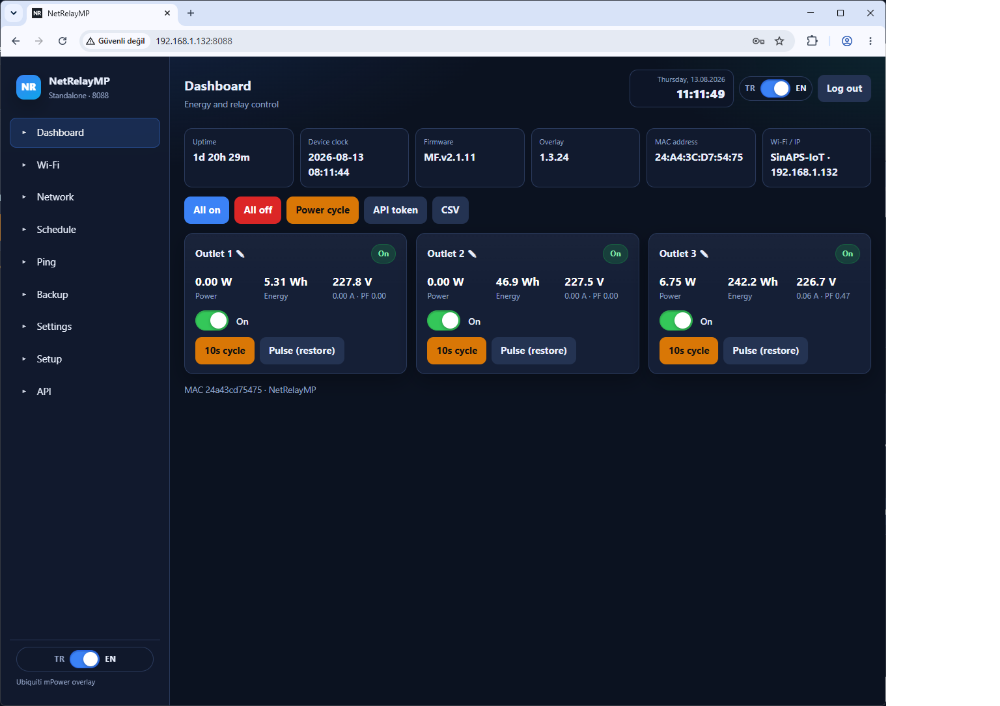
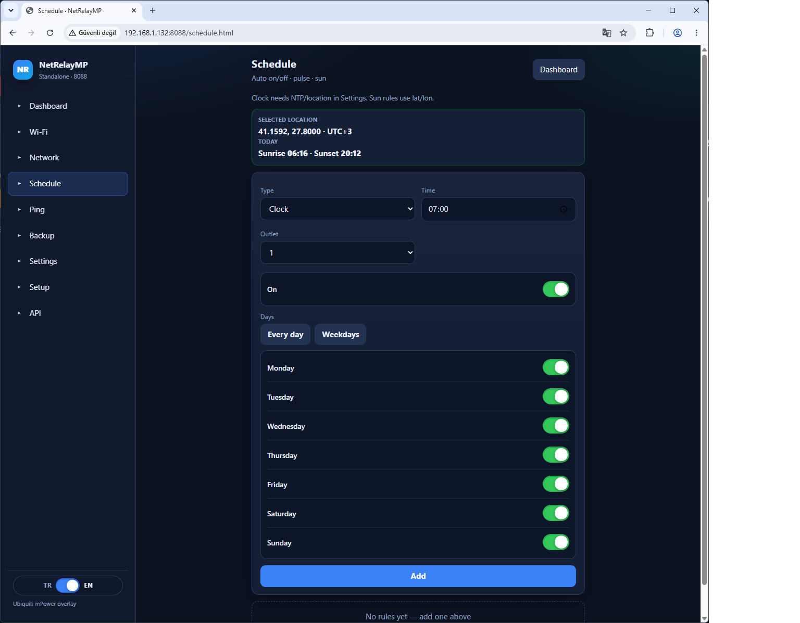
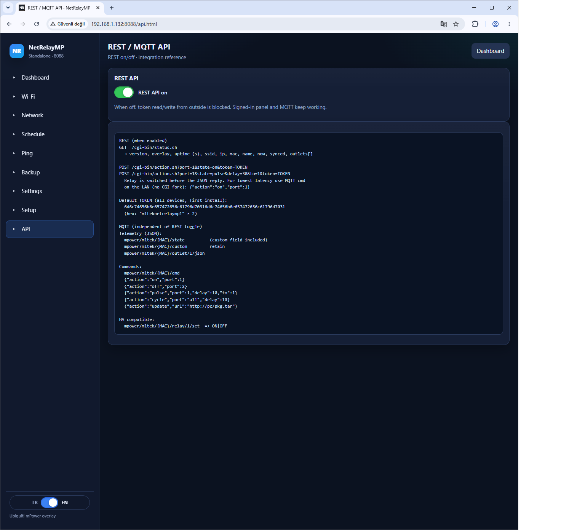
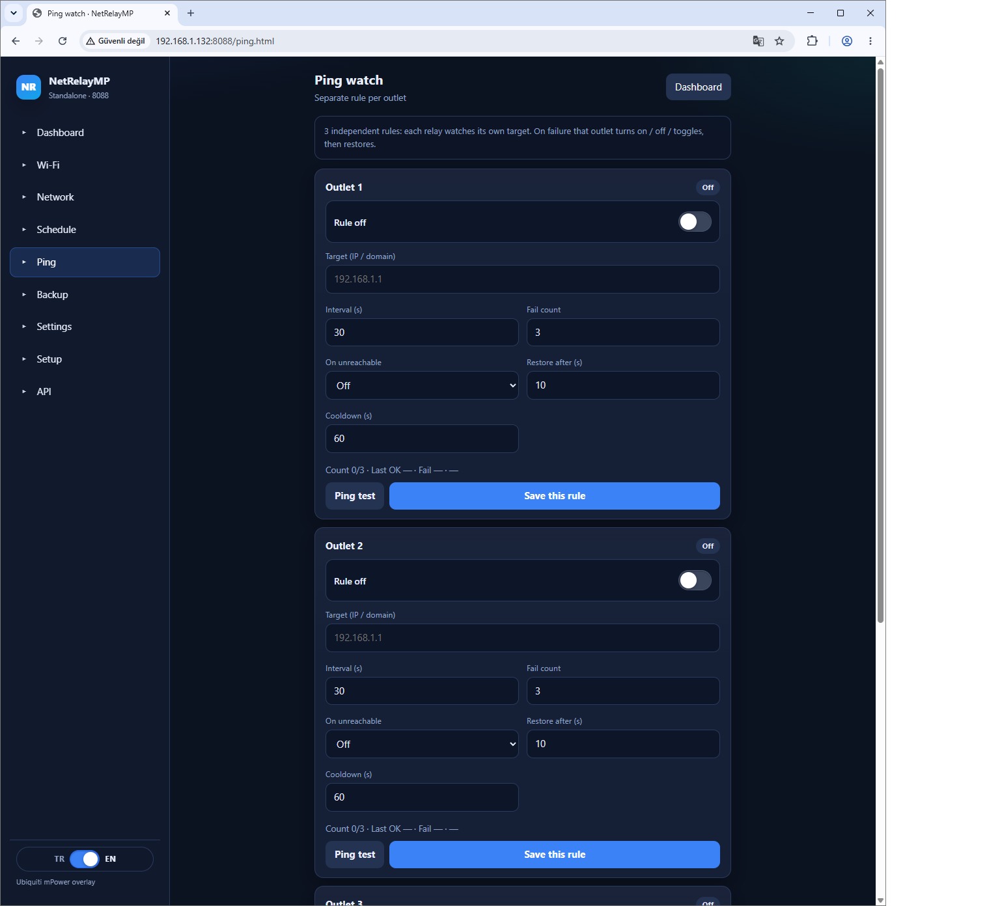

# NetRelayMP features

Screenshots are from the English UI (`http://DEVICE-IP:8088`).

## Dashboard

Each outlet is **live** on the dashboard — watch and switch:

| Field | Meaning |
|-------|---------|
| On / Off | Relay state (badge + toggle) |
| Power (W) | Instantaneous power |
| Energy (Wh) | Accumulated energy |
| V / A / PF | Voltage (e.g. 227.2 V), current, power factor |

- Toggle a single outlet
- **All on / off**, **10 s cycle**, **Pulse (restore)** — e.g. on for 2 s then back to the previous state
- Header: uptime, device clock, firmware, overlay, MAC, Wi‑Fi / IP

## Schedule

**Schedule** menu: clock on/off, pulse, sun.

- **Days of week:** Mon–Sun individually, **Every day** or **Weekdays**
- **Clock:** e.g. 07:00 turn outlet 1 on
- **Sunset + offset:** lights on **30 min after sunset** → type **Sunset**, offset `+30`, action On
- **Sunrise + offset:** off **30 min before sunrise** → type **Sunrise**, offset `-30`, action Off
- **1 hour on, 1 hour off:** type **Pulse**, duration `3600` s (on for one hour, then restore). Repeat by adding the same pulse every 2 hours (00:00, 02:00, 04:00…) or clock **On** on the hour / **Off** at :30

Location (default Çorlu) and NTP are under **Settings**; today’s sunrise/sunset show on the schedule page.

## REST API and MQTT

Enable/disable REST on the **API** page. MQTT is configured under **Settings** (recommended broker: [mqttserver](https://github.com/mlteknoloji/mqttserver), port **31883**).

- **REST:** `GET /cgi-bin/status.sh` to read · `POST /cgi-bin/action.sh?...&token=TOKEN` for on/off/pulse
- **MQTT:** `mpower/mltek/{MAC}/state` to read · `.../cmd` with `{"action":"on","port":1}` etc.
- When REST is off, token access from outside stops; the signed-in panel and MQTT keep working

Details: [MQTT-EN.md](MQTT-EN.md)

## Ping watch

Each outlet pings its own target (IP / domain). If unreachable, that outlet turns on / off / toggles, then **restores** after the set seconds.

Example — if an IP is unreachable, **turn port 1 off for 10 s, then on** (if it was on):

| Field | Value |
|-------|--------|
| Rule | on |
| Target | e.g. `192.168.1.1` |
| On unreachable | **Off** |
| Restore after (s) | **10** |

Triggers after 3 consecutive fails; cooldown prevents back-to-back actions.

## Buy and repos

- Hardware: [BUY-EN.md](BUY-EN.md)
- Software: [ubnt_mPOWER](https://github.com/mlteknoloji/ubnt_mPOWER) · broker: [mqttserver](https://github.com/mlteknoloji/mqttserver)
