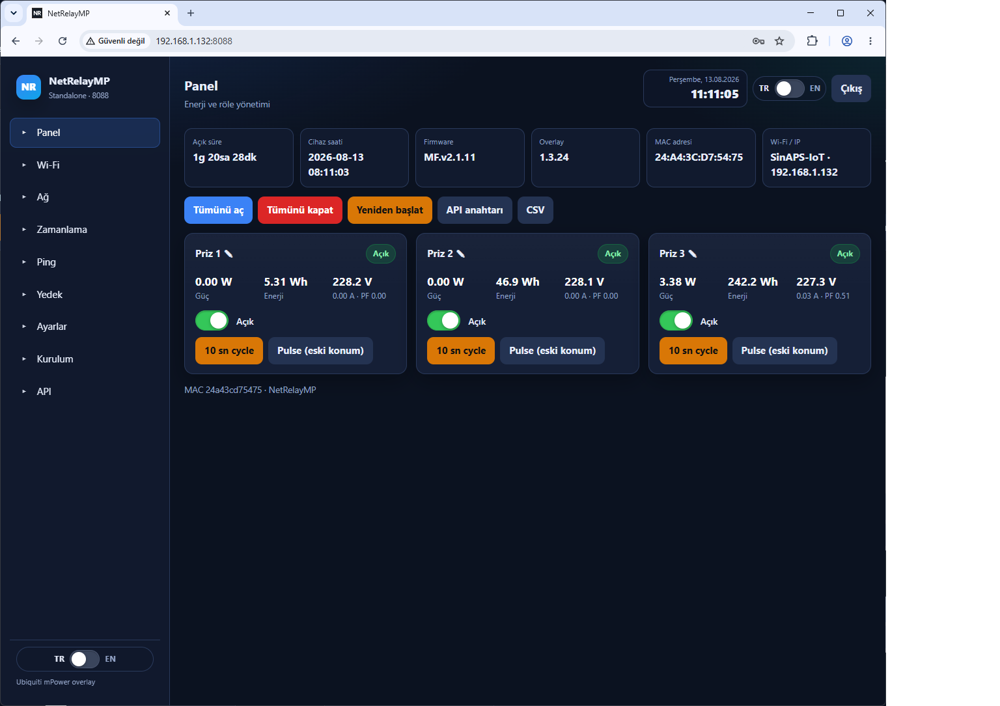
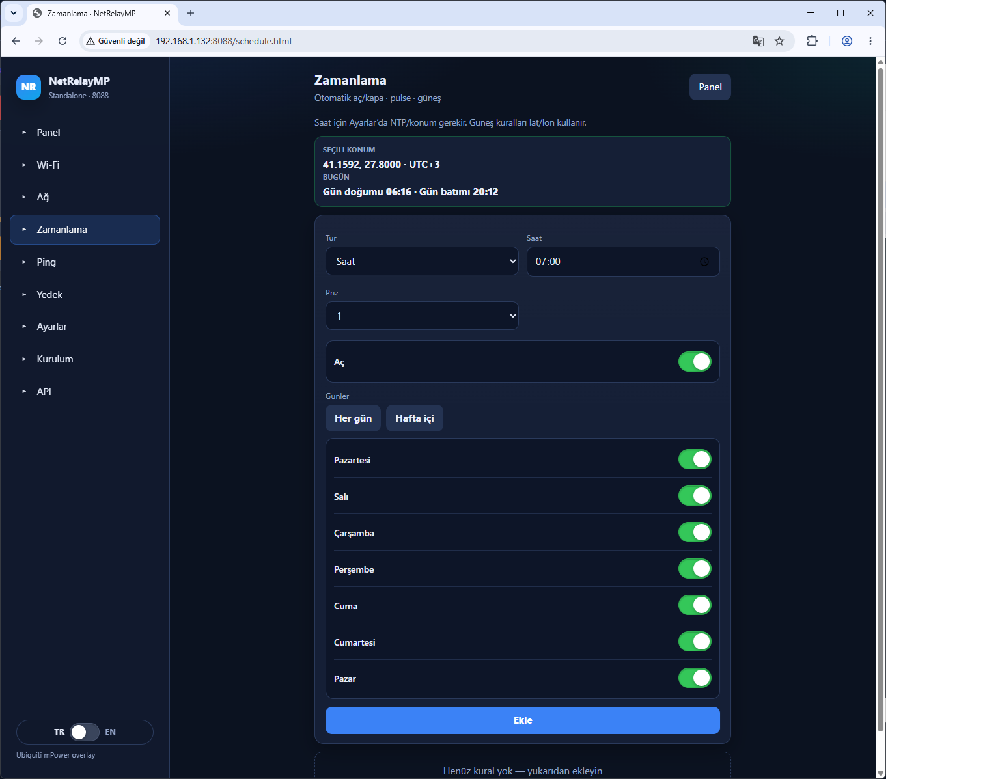
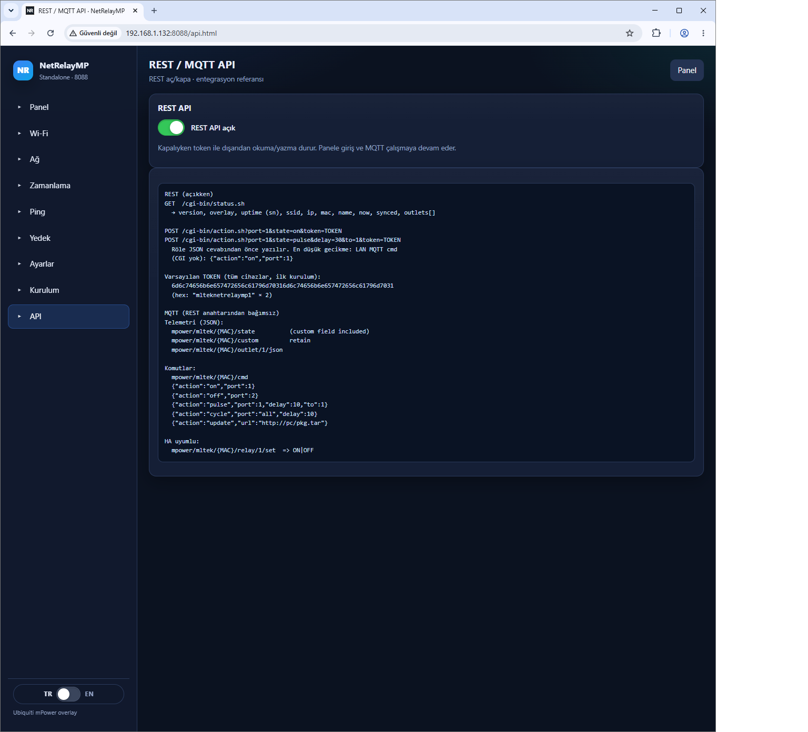
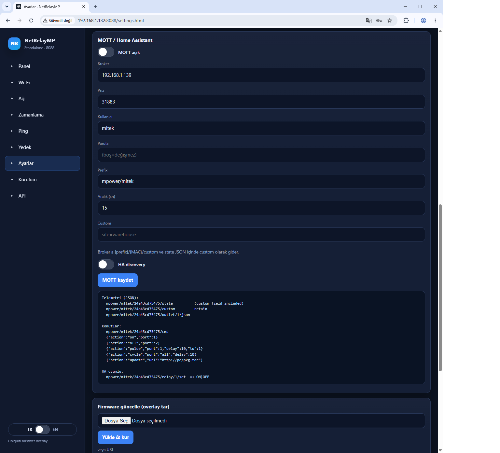
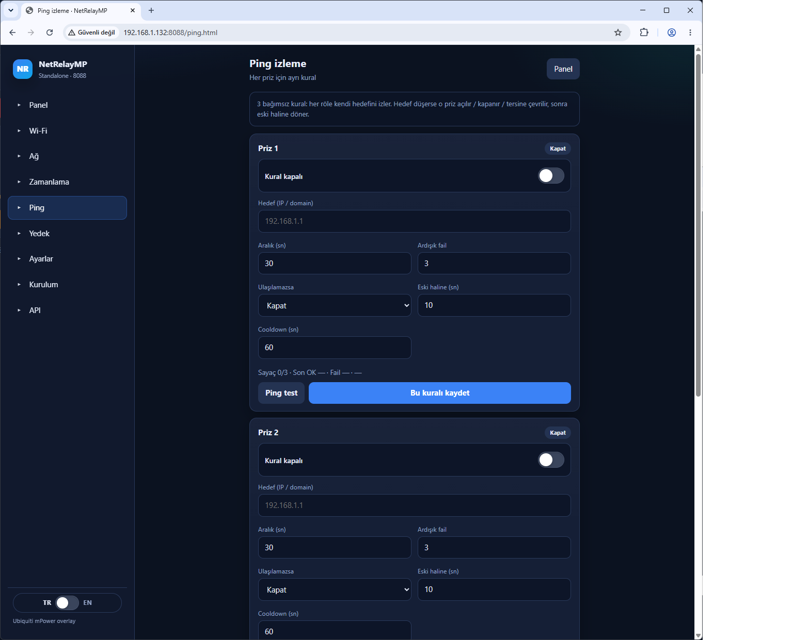

# NetRelayMP özellikleri

Ekran görüntüleri Türkçe arayüzdendir (`http://CIHAZ-IP:8088`).

## Panel (dashboard)

Panelde her priz **anlık** izlenir ve açılıp kapatılır:

| Alan | Anlamı |
|------|--------|
| Açık / Kapalı | Röle durumu (yeşil rozet + anahtar) |
| Güç (W) | Anlık güç |
| Enerji (Wh) | Birikmiş enerji |
| V / A / PF | Voltaj (örn. 227.2 V), akım, güç faktörü |

- Anahtarla tek priz aç/kapa
- **Tümünü aç / kapat**, **10 sn cycle**, **Pulse (eski konum)** — örn. 2 sn açıp önceki duruma dön
- Üstte uptime, cihaz saati, firmware, overlay, MAC, Wi‑Fi / IP

## Zamanlama

**Zamanlama** menüsü: otomatik aç/kapa, pulse, güneş.

- **Haftanın günleri:** Pazartesi–Pazar tek tek, **Her gün** veya **Hafta içi**
- **Saat:** örn. 07:00 priz 1 açılsın
- **Gün batımı + ofset:** güneş battıktan **30 dk sonra** ışıkları aç → tür **Gün batımı**, ofset `+30`, durum Aç
- **Gün doğumu + ofset:** güneş doğmadan **30 dk önce** kapat → tür **Gün doğumu**, ofset `-30`, durum Kapa
- **1 saat çalışsın, 1 saat dursun:** tür **Pulse**, süre `3600` sn (1 saat açık sonra eski haline). Bunu tekrarlamak için aynı pulse’u 2 saatte bir saat kuralıyla ekleyin (00:00, 02:00, 04:00…) veya her saat başı **Aç** / `:30` **Kapa** saat kuralları koyun

Konum (varsayılan Çorlu) ve NTP **Ayarlar**’dadır; bugünün gün doğumu/batımı zamanlama sayfasında görünür.

## REST API ve MQTT

**API** menüsünden REST aç/kapa. MQTT **Ayarlar**’dan bağlanır (önerilen broker: [mqttserver](https://github.com/mlteknoloji/mqttserver), port **31883**).

- **REST:** `GET /cgi-bin/status.sh` okuma · `POST /cgi-bin/action.sh?...&token=TOKEN` aç/kapa/pulse
- **MQTT:** `mpower/mltek/{MAC}/state` okuma · `.../cmd` ile `{"action":"on","port":1}` vb.
- REST kapalıyken token’lı dış erişim durur; panel ve MQTT çalışır

Ayrıntı: [MQTT-TR.md](MQTT-TR.md)

## Ping izleme (watchdog)

Her priz kendi hedefini (IP / domain) ping’ler. Ulaşılamazsa o priz açılır / kapanır / tersine çevrilir, süre dolunca **eski haline** döner.

Örnek — IP’ye erişilemezse **port 1’i 10 sn kapat, sonra aç** (priz açıktıysa):

| Alan | Değer |
|------|--------|
| Kural | açık |
| Hedef | örn. `192.168.1.1` |
| Ulaşılamazsa | **Kapat** |
| Eski haline (sn) | **10** |

3 ardışık fail sonrası tetiklenir; cooldown peş peşe basmayı keser.

## Satın alma ve depolar

- Donanım: [SATIN-AL-TR.md](SATIN-AL-TR.md)
- Yazılım: [ubnt_mPOWER](https://github.com/mlteknoloji/ubnt_mPOWER) · broker: [mqttserver](https://github.com/mlteknoloji/mqttserver)
