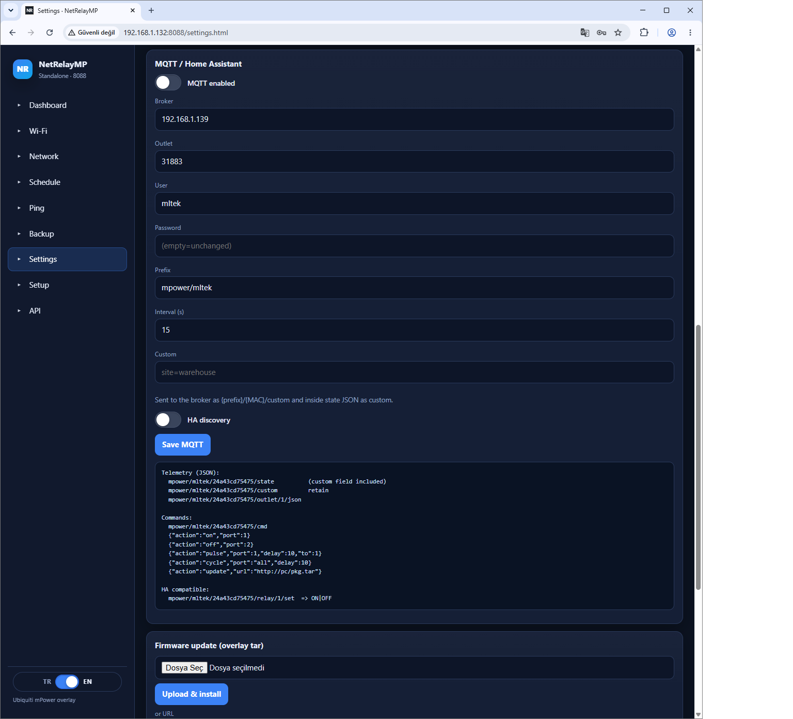

# NetRelayMP MQTT (EN)

The device is an MQTT **client**. The broker runs separately. Recommended: [mqttserver](https://github.com/mlteknoloji/mqttserver) (port **31883**, panel **8082**). Repos: [REPOS-EN.md](REPOS-EN.md).

Screenshots: [FEATURES-EN.md](FEATURES-EN.md)

## Config



Settings → MQTT: `enabled`, `host`/`port`, `user`/`pass`, `prefix` (default `mpower/mltek`), `interval`, `ha_discovery`.

Root: `{prefix}/{MAC}/` (default: `mpower/mltek/{MAC}/`; lowercase MAC, no colons).

## State

Periodic JSON + optional Home Assistant MQTT discovery.

## Commands

Topic: `{prefix}/{MAC}/cmd`

```json
{"action":"on","port":1}
{"action":"off","port":2}
{"action":"pulse","port":1,"seconds":5}
{"action":"cycle","port":1,"on":2,"off":2,"count":3}
{"action":"update","url":"http://host/pkg.tar"}
```

## Field check

```bash
mosquitto_sub -h BROKER -t 'mpower/mltek/#' -v
mosquitto_pub -h BROKER -t 'mpower/mltek/aabbccddeeff/cmd' -m '{"action":"off","port":1}'
```

See [SAHA-EN.md](SAHA-EN.md).

Apple Home: [HOMEKIT-EN.md](HOMEKIT-EN.md)
